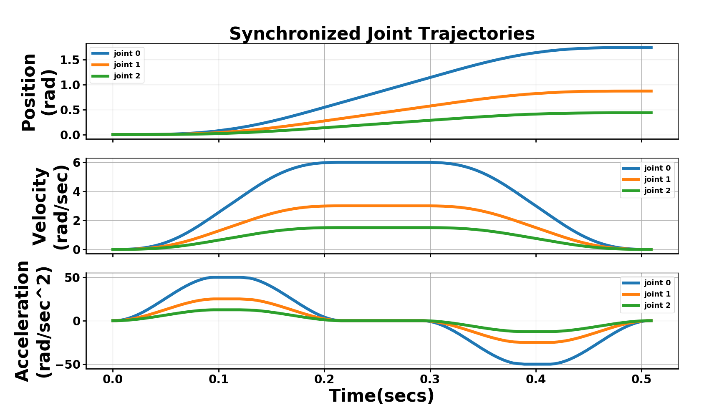

# STOPP

Safe Time Optimal Path Parameterization (STOPP) for serial robots, this produces
a jerk limited, joint synchronized trajectories for smooth and safe robot motion for a given predefined path.

## Dependencies

numpy >= 1.12.0

## Installation
```
$ pip install stopp
```

## Sample Usage
```Python
import stopp
import numpy as np
from math import pi

robot_path = np.array([np.linspace(0, 150, 30),\
                       np.linspace(50, 100, 30)]) # here assumes two joints
my_robot = stopp.Robot(n_joints=robot_path.shape[0], j_max=800, a_max=50, v_max=6, d_max=50)
trajectory = my_robot.TimeParameterizePath(robot_path, interp_time_step=0.004)

first_joint_trajectory = trajectory[0]
second_joint_trajectory = trajectory[1]

first_joint_time = first_joint_trajectory.t
firs_joint_pos = first_joint_trajectory.pos
first_joint_vel = first_joint_trajectory.vel
first_joint_acc = first_joint_trajectory.acc
```

## Sample Result


